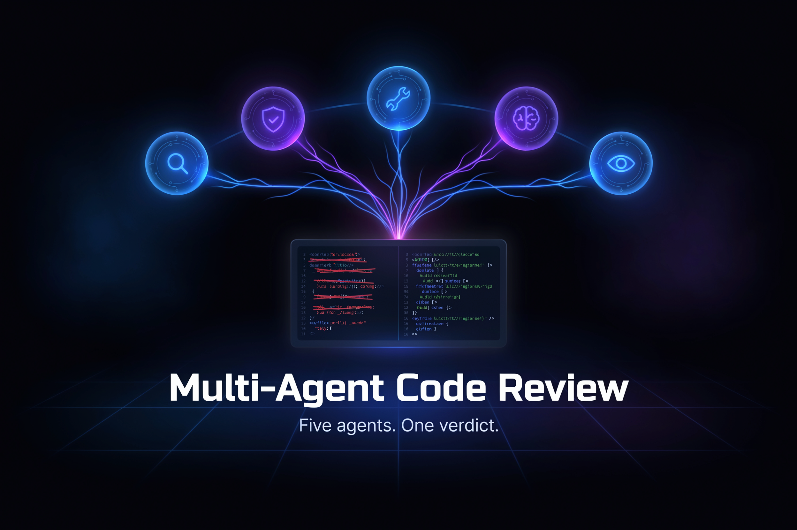

<div align="center">



# 🤝 Multi-Agent Code Review

**Five specialist AI agents review your code concurrently, debate findings, and deliver a consensus report.**


</div>

<br/>

Multi-Agent Code Review orchestrates five specialist AI agents — Static Analysis, Security, Performance, Documentation, and Test Coverage — that concurrently inspect your code and debate conflicting findings. A Moderator agent runs up to three rounds of consensus-building, escalating anything unresolved for human review. Built for the [Global AI Hackathon with Qwen Cloud](https://qwenhackathon.devpost.com/) (Track 3: Agent Society).

## ✨ Features

- **Concurrent specialist agents** — five agents review your code in parallel, each focused on a distinct concern (style, security, performance, docs, and test coverage)
- **Debate-driven consensus** — a Moderator agent runs up to 3 rounds of structured debate to resolve conflicting findings before surfacing them
- **Human escalation** — unresolved conflicts are flagged explicitly for human review so nothing slips through
- **CLI + REST API** — review files directly from the terminal or integrate via a local FastAPI server
- **Git diff support** — pass `git diff` output alongside a file to focus review on only what changed
- **Rich terminal output** — findings rendered as a severity-sorted table with per-finding panels showing description, suggestion, evidence, and consensus status

## 🛠️ Tech Stack

| Layer | Technology |
|---|---|
| Orchestration & Moderation | `qwen-max` |
| Specialist Agents | `qwen-plus` (×5) |
| API Server | FastAPI |
| Terminal UI | Rich |
| Language | Python 3 |

### Architecture

See [`architecture_diagram.md`](architecture_diagram.md) for the full system diagram.

```
Input: source file + optional git diff
    │
    ▼
Orchestrator (qwen-max)
    │  dispatches concurrently
    ├── StaticAnalysisAgent (qwen-plus)
    ├── SecurityAgent       (qwen-plus)
    ├── PerformanceAgent    (qwen-plus)
    ├── DocumentationAgent  (qwen-plus)
    └── TestCoverageAgent   (qwen-plus)
    │
    ▼
ModeratorAgent (qwen-max)
    │  up to 3 debate rounds on conflicting findings
    ▼
ConsensusResult
    ├── consensus_findings   (agreed findings with severity + confidence)
    ├── unresolved_conflicts (escalated for human review)
    └── metrics              (conflicts detected/resolved, human review flag)
```

## 🚀 Getting Started

### 1. Install

```bash
python -m venv .venv && source .venv/bin/activate
pip install -r requirements.txt
```

### 2. Configure

```bash
cp .env.example .env
# Set QWEN_API_KEY=your_key_here in .env
```

### 3. Review a file

```bash
# Review a file
python main.py review path/to/file.py

# Review with a git diff
python main.py review path/to/file.py --diff "$(git diff HEAD~1 path/to/file.py)"
```

### 4. Run as an API server

```bash
python main.py serve
# POST http://localhost:8000/review
```

## ☁️ Deploy (Alibaba Cloud)

The project ships a self-contained deployment script for [Alibaba Cloud Function Compute v3](https://www.alibabacloud.com/product/function-compute): [`deploy/alibaba_cloud.py`](deploy/alibaba_cloud.py).

The script uses the Alibaba Cloud **FC** (Function Compute), **ECS**, and **credentials** SDKs to package the application, create or update a Function Compute service, and wire up the HTTP trigger — no manual console steps required.

**Run it with:**

```bash
python deploy/alibaba_cloud.py
```

Credentials are read from the standard Alibaba Cloud environment variables (`ALIBABA_CLOUD_ACCESS_KEY_ID`, `ALIBABA_CLOUD_ACCESS_KEY_SECRET`) or from `~/.alibabacloud/credentials`.

## 📊 Benchmarks

A reproducible benchmark suite lives in [`benchmarks/evaluate.py`](benchmarks/evaluate.py). It runs the full multi-agent pipeline against three sample files (in `benchmarks/samples/`) that have a known set of ground-truth issues, then reports **precision** and **recall** for each specialist agent and for the consensus output.

**Run the benchmarks:**

```bash
python benchmarks/evaluate.py
```

Results are printed to stdout as a table. No API mocking is used — the benchmark hits the live Qwen endpoints, so make sure `QWEN_API_KEY` is set in your `.env` before running.

**For hackathon judges:** the three sample files cover a security vulnerability, a performance anti-pattern, and a missing-documentation case. Expected findings are defined inline in `evaluate.py` so you can verify the scoring logic at a glance.

## 📄 License

MIT
