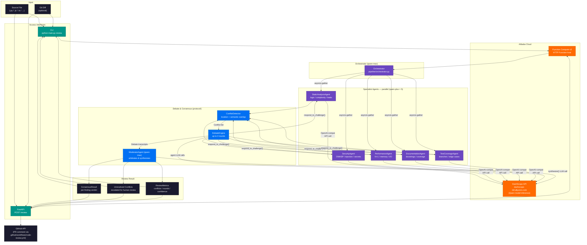
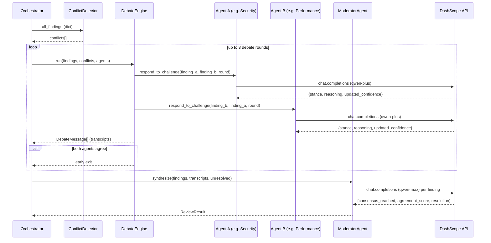

# Architecture Diagram — Multi-Agent Code Review

## Component Summary

| Component | File(s) | Model | Role |
|---|---|---|---|
| Orchestrator | `pipeline/orchestrator.py` | `qwen-max` | Fans out to specialists, coordinates phases |
| StaticAnalysisAgent | `agents/static_analysis.py` | `qwen-plus` | Logic errors, complexity, resource leaks |
| SecurityAgent | `agents/security.py` | `qwen-plus` | OWASP Top 10, injection, hardcoded secrets |
| PerformanceAgent | `agents/performance.py` | `qwen-plus` | N+1 queries, memory pressure, I/O blocking |
| DocumentationAgent | `agents/documentation.py` | `qwen-plus` | Docstring coverage, API contract clarity |
| TestCoverageAgent | `agents/test_coverage.py` | `qwen-plus` | Branch coverage gaps, missing edge cases |
| ConflictDetector | `protocol/consensus.py` | — | Location + semantic overlap detection |
| DebateEngine | `protocol/debate.py` | — | Runs up to 3 structured debate rounds |
| ModeratorAgent | `agents/moderator.py` | `qwen-max` | Arbitrates debate, builds ConsensusResult |
| FastAPI server | `api/main.py` | — | REST interface (`POST /review`, `GET /health`) |
| CLI | `main.py` | — | Terminal interface with Rich output |
| FC Deployment | `deploy/alibaba_cloud.py` | — | Alibaba Cloud Function Compute + ECS/VPC |

## Debate / Moderation Flow

